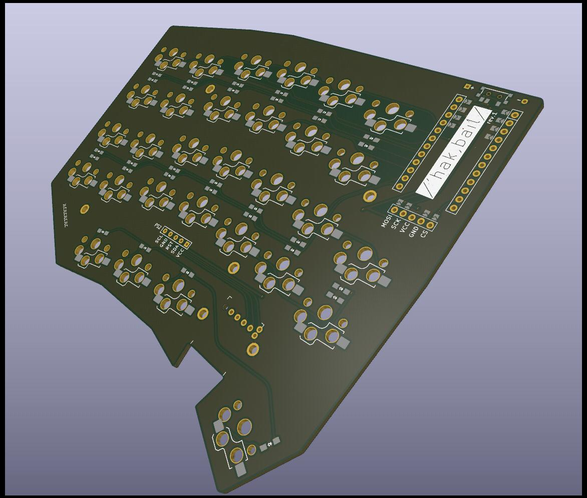
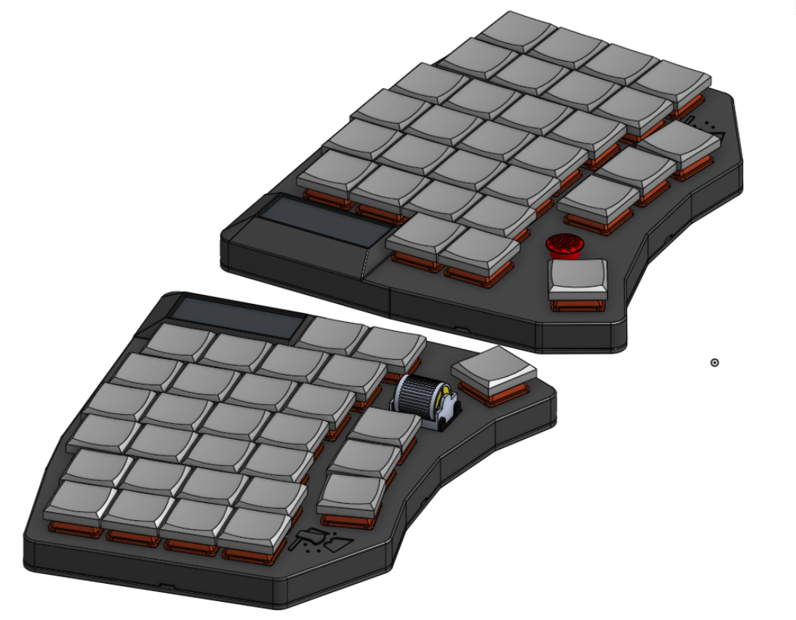

# Hackbeil (/ˈhakˌbaɪ̯l/)

My custom 60 key wireless split keyboard. Inspired by [Lily58](https://github.com/kata0510/Lily58). (Will be) Built with [ergogen](https://ergogen.xyz) and [zmk](https://zmk.dev).

## Setup

Install ergogen, e.g., with `yarn`:

    yarn global add ergogen

## Building

Using `make`:

    make

The output will be placed in the `build` directory.

Next, use KiCad to add traces or try your luck with freerouting.
That will likely require some modifications to the footprints though.
